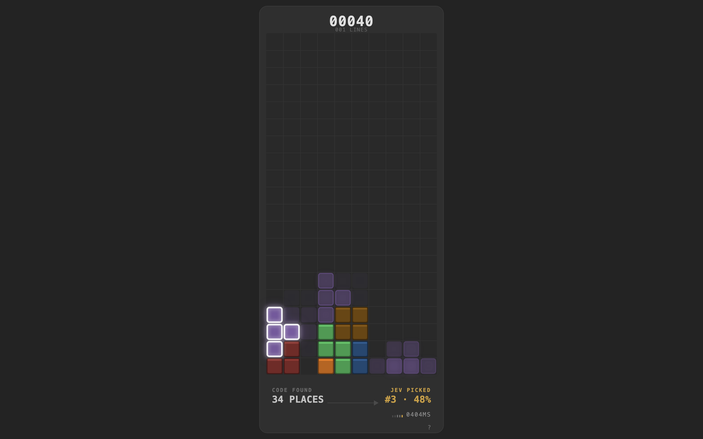

# Glow Tetris

**A Tetris that a judgment model plays — where the interesting frame is the half second *before* the move.**

JEV cannot count and cannot see. So the code does all the geometry: it searches
every resting place the piece can actually be manoeuvred into — moving, rotating
and dropping in any order, so tucks and spins are included, around 23 on average
and up to 37 — simulates each one, and writes each outcome as a sentence.

> *Traps no new space underneath. Clears one line. Flattens the surface out. The
> stack stays low. It goes at the centre, lying flat.*

JEV reads those sentences and picks one. It never sees the board, or a number.

What comes back is not just a choice but a probability for every option, in about
380ms. So before the piece falls the board fills with the whole shape of the
decision — every cell glowing by how much the machine wants to land there, the
chosen placement ringed in white. Then it commits, and the field goes out.

Two materials, and the difference between them is the point. Settled blocks are
plastic: bevelled, physical, the past. Wanting is flat light with no edges.

**The stack records its own doubt.** Each block's brightness is how certain the
machine was when it placed it. By the end you are reading a wall: bright where it
knew, dim where it was guessing. When it loses, the colour drains and the texture
stays.



Every state of the interface is captured in [docs/stills/states/](docs/stills/states/),
regenerated by `node tools/states.js`.

## Run it

Needs Node 20+. No dependencies, no build step, nothing to install.

**Without an API key**, on mock answers — everything works, it just plays badly:

```bash
node server.js --mock        # -> http://localhost:5173
```

**For real**, with a key from [typesafe.ai](https://typesafe.ai):

```bash
cp .env.example .env         # put your TYPESAFE_API_KEY in it
node server.js               # -> http://localhost:5173
```

A game runs 60 to 130 seconds and costs about six cents. The key stays on the
server; the browser never sees it.

| | |
|---|---|
| `?hold=900` | hold the field longer — for filming |
| `?seed=42` | fix the piece sequence |
| `?auto=1` | restart itself forever, for a loop or a screen |
| `WHY` | every option, what the model gave each, and which question decided it |
| `?` | what everything on screen means |

## Tests

```bash
node tools/e2e.js            # 21 checks, mocked: no key, no cost
```

Drives the real page in headless Chrome: that it plays, that nothing scrolls at
five viewport sizes, that the overlays open and close, that losing the connection
stalls rather than ending the game, and that restart works.

## Does JEV actually play it?

Yes — and the controls matter more than the score, so they go first.

| Player | Pieces (3 seeds) | Lines |
|---|---|---|
| Random | 26 · 19 · 22 | 0 · 0 · 0 |
| **JEV, probabilities shuffled** | 26 · 22 · 25 | 0 · 0 · 0 |
| **JEV as built** | 155 · 123 · 200 | 46 · 34 · 76 |
| **Keyword lookup on the same sentences** | 200 · 200 · 200 | 78 · 78 · 79 |
| El-Tetris heuristic | 200 · 200 · 200 | 77 · 75 · 78 |

Keep the model's exact numbers and scramble only which option each belongs to,
and play collapses to precisely random. So JEV's ranking is doing the work —
nothing in the code is steering behind it.

And `src/words.js`, 23 lines of regex over the identical sentences, beats it. So
the descriptions already contain enough to play well, and JEV decodes them
imperfectly.

**The honest claim is therefore narrow: given only prose, JEV ranks options well
enough to play credible Tetris, far above random.** Not that JEV is good at Tetris.

Three further things an adversarial review confirmed, all of which cut against
the project and all of which are in [docs/findings.md](docs/findings.md): three
seeds cannot support a ratio like "60% of a heuristic" (the interval spans random
to parity, so that claim was removed); the configuration was tuned on the same
three seeds; and with the voices weighted equally the score collapses from ~52
lines to ~12, so most of the scoring comes from weights we fitted rather than
from the model. Replaying 1,578 logged turns, the blend's pick matches the
`sealed` voice's own top choice 91% of the time — the "five voices" are close to
one question.

```bash
node spike/play.js --player jev --pieces 200            # the real thing
node spike/play.js --player jev --pieces 200 --shuffle  # the honesty control
node spike/play.js --player words --pieces 200          # the number to beat
node spike/play.js --player heuristic --pieces 200      # the ceiling
```

- [docs/findings.md](docs/findings.md) — everything measured, including two things that did not work
- [docs/what-jev-does.md](docs/what-jev-does.md) — the exact division of labour, and what it costs
- [docs/ideas.md](docs/ideas.md) — eleven other pieces this model suggests

## Making it your own

Two files are worth editing:

- **`src/describe.js`** — how geometry becomes English, and the five questions
  (`VOICES`) the model is asked. Change a question and the game changes character.
  The weights are ours and the judgements are its; both live here.
- **`public/main.js`** — the render. Palette, the glow curve (`FIELD_GAMMA`,
  `FIELD_FLOOR`), the two materials.

Every call is written raw to `runs/<timestamp>.jsonl` before its answer is used.
`node tools/runlog.js` summarises latency, tokens and cost. That log is how the
biggest bug here was found: two sentences that contradicted each other were
costing half the game.

## Layout

```
src/tetris.js      engine - every number in the project lives here
src/describe.js    geometry into words, and the five voices
src/jev.js         API client
src/heuristic.js   baseline bots to measure against
src/words.js       the keyword control that beats the model
server.js          static files, one proxy route holding the key, and --mock
public/main.js     the game loop and the render
spike/             the headless experiments that decided the design
tools/e2e.js       end-to-end tests
tools/shot.js      headless screenshots
tools/runlog.js    what a run cost
runs/              every call to the model, raw, as it happened (gitignored)
```

The model is a week old and priced below cost by the vendor's own admission, so
treat every number here as provisional.
